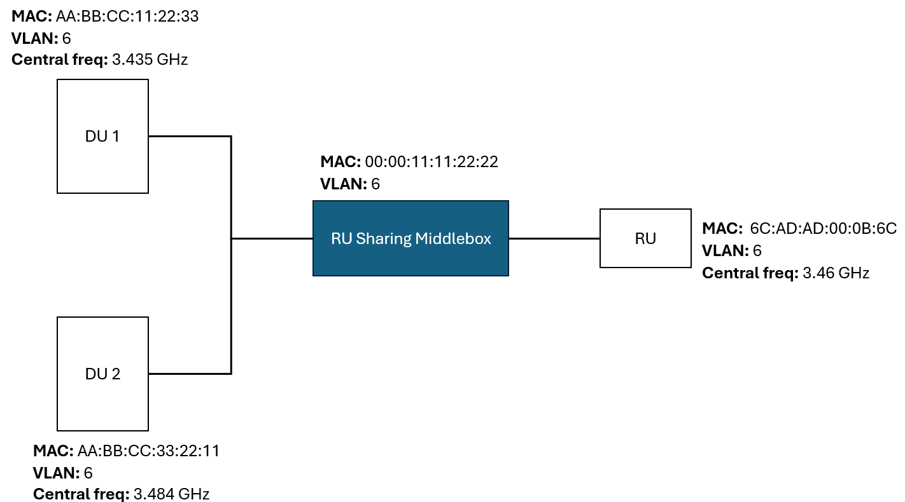

This example configures and runs the middlebox deployment shown in the figure below:



The example enables RU sharing between two DUs.

**Note:** Support for more DUs will be added in the future.

The scripts have to be modified to match the interface names, MAC addresses and VLANs of your deployment. Also, please make sure to source `setup_runbooster_env.sh` before running the scripts.

To setup the NIC, you need to run:
```bash
sudo setup_switch_mlx.sh
```

To run the middlebox on CPU core N, you need to run:
```bash
sudo -E ./run_middlebox.sh N
```

The script contains comments about how to configure the parameters for the frequencies of the RU and the DUs.

Finally, to clean up the configurations, you can run:
```bash
sudo ./teardown_switch_mlx.sh
```
